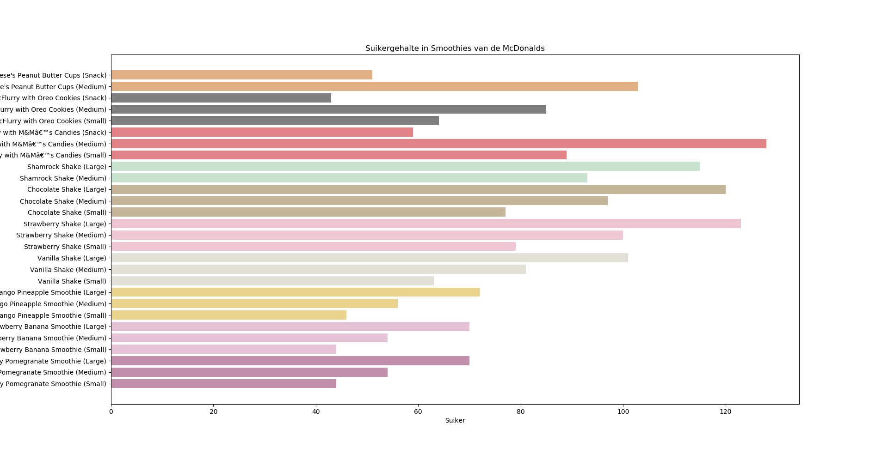
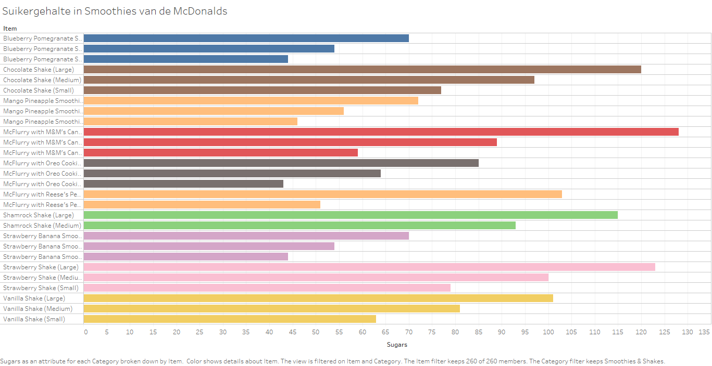

# Assignment

## Dataset 

```{r}
mcdonalds = read.csv("menu.csv")

head(mcdonalds[1:4], 5) # first five rows, first 4 columns
```
There are a lot more columns, but I cut them off for readability's sake.

The data consists of a number of features of a variety of McDonalds products. I got this data during the "Data science and biology" bachelor course with the assignment:  "Make a figure". It was up to us what feature we wanted to visualize and how our figures would look. I decided on showing the amounts of sugar in different smoothies and shakes and I thought it'd be funny if the color of the bar would correspond with the color of the product. This took quite some googling for pictures of smoothies and then deciding on the right hexadecimal color code. Hopefully I'll be able to include my figure in this notebook. I'll try to include both the python produced figure I made then, and a new Tableau version.

## Figures


*Python figure of sugar in smoothies and shakes*

*Tableau version*

It seems like tableau is way easier because picking the right parts of the data is quite intuitive. However, I did have some issues with the header, and I don't think I can pick a color based on hexadecimal code, as I could in python. This kinda limited the amount of colors to choose from.

I tried to find how to add the image description underneath the image in small letters. 
